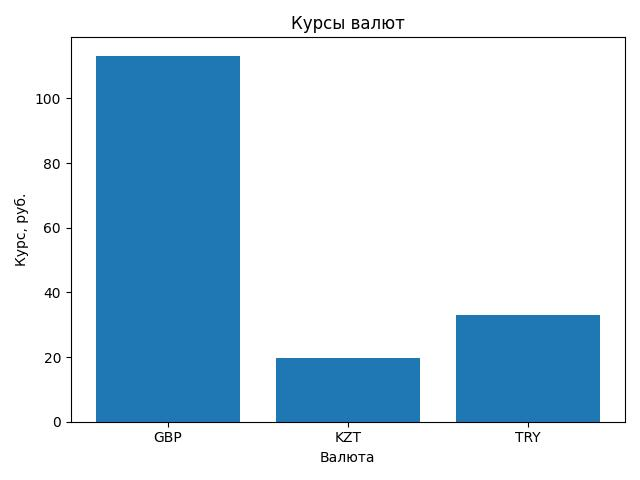

# Лабораторная работа: валюты и шаблон «Одиночка»

## Описание

В проекте реализована работа с курсами валют Центрального банка РФ в объектно-ориентированном стиле.  
Главная цель лабораторной работы — показать применение шаблона проектирования **Singleton / «Одиночка»**.

Одиночка нужен для того, чтобы у класса был только один объект. В этой работе это логично: сервис для получения курсов валют должен иметь единое состояние — список выбранных валют, результат последнего запроса и время последнего обращения к сайту.

## Что реализовано

В проекте реализован класс `CurrenciesRates`, который:

- получает курсы валют с сайта ЦБ РФ;
- реализует шаблон **Singleton** через метакласс `SingletonMeta`;
- не позволяет создать больше одного объекта класса;
- хранит входные параметры через свойства `currencies_ids`, `request_interval`, `source_url`;
- хранит результат последнего запроса в свойстве `result`;
- возвращает результат в формате списка словарей;
- хранит значение курса отдельно как целую и дробную часть;
- сохраняет номинал валюты, если он не равен `1`;
- контролирует слишком частые запросы к сайту;
- строит график курсов валют и сохраняет его в файл `currencies.jpg`;
- содержит докстринги и аннотации типов.

## Пример результата

```python
[
    {'GBP': ('Фунт стерлингов Соединенного королевства', ('113', '2069'))},
    {'KZT': ('Казахстанских тенге', ('19', '8264'), 100)},
    {'TRY': ('Турецких лир', ('33', '1224'), 10)}
]
```

Если код валюты указан неверно, возвращается словарь с этим кодом и значением `None`:

```python
[{'R9999': None}]
```

## График

Метод `visualize_currencies()` сохраняет график в файл `currencies.jpg`.



## Структура проекта

```text
singleton_currency_project/
├── currencies.py
├── main.py
├── test_currencies.py
├── requirements.txt
├── README.md
└── .gitignore
```

## Как запустить пример

Сначала установите зависимости:

```bash
pip install -r requirements.txt
```

Затем запустите пример:

```bash
python main.py
```

После запуска программа выведет список валют и сохранит график в файл `currencies.jpg`.

## Как запустить тесты

```bash
python -m unittest test_currencies.py
```

## Краткое объяснение Singleton

В файле `currencies.py` есть метакласс `SingletonMeta`. Он переопределяет создание объекта.  
Если объект класса `CurrenciesRates` уже был создан, то при следующем вызове конструктора возвращается тот же самый объект.

Пример:

```python
first = CurrenciesRates(["R01035"])
second = CurrenciesRates(["R01335"])

print(first is second)  # True
```

То есть `first` и `second` — это один и тот же объект.
